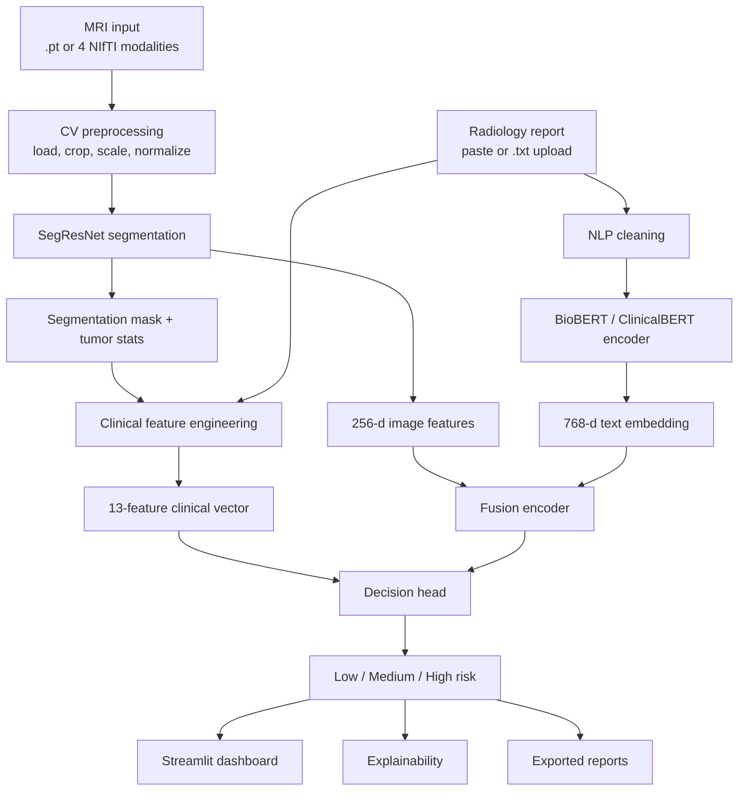

# CortexAI

<h1 align="center">CortexAI</h1>
<p align="center">
    Multimodal brain tumor clinical decision support system for MRI segmentation, radiology-report NLP, fusion risk prediction, and interactive analysis.
</p>

<p align="center">
    <a href="https://cortexai.streamlit.app/">
        
    </a>
    <a href="https://github.com/nour-hossam7/CortexAI">
        
    </a>
    <a href="#architecture">
        
    </a>
</p>

<p align="center">
    
    
    
    
    
</p>

## Table of Contents

- [Overview](#overview)
- [Features](#features)
- [Screenshots](#screenshots)
- [Architecture](#architecture)
- [Folder Structure](#folder-structure)
- [Technologies](#technologies)
- [Installation](#installation)
- [Live Demo](#live-demo)
- [Usage](#usage)
- [Models](#models)
- [Dataset](#dataset)
- [Workflow](#workflow)
- [Performance](#performance)
- [Project Highlights](#project-highlights)
- [Future Improvements](#future-improvements)
- [Contributing](#contributing)
- [License](#license)
- [Authors](#authors)
- [Acknowledgments](#acknowledgments)
- [Contact](#contact)

## Overview

CortexAI is a Streamlit-based multimodal decision support application for brain tumor analysis. It combines 3D MRI segmentation, radiology-report NLP, clinical feature engineering, fusion-based risk prediction, and explainability tools in a single workflow.

The project exists to show how imaging, text, and structured clinical signals can be combined into one operational pipeline. It is useful for researchers, students, developers, and reviewers who want a reproducible brain tumor AI demo rather than a notebook-only prototype.

The implementation is organized around three real inference paths:

- MRI analysis for segmentation, tumor statistics, and Grad-CAM
- Clinical report analysis for entity highlighting and NLP-derived features
- Fusion AI for low / medium / high risk prediction

## Features

### MRI and segmentation

- Upload a preprocessed `.pt` volume or four raw MRI modalities (`FLAIR`, `T1`, `T1ce`, `T2`)
- Run 3D SegResNet inference on BraTS2020-style MRI volumes
- Generate segmentation masks for the four class labels used in the project
- Compute tumor statistics, bounding boxes, and volume summaries
- Visualize MRI slices, 3D tumor views, and Grad-CAM overlays

### Clinical text analysis

- Paste a report or upload a `.txt` clinical note
- Clean radiology text with lightweight whitespace normalization
- Extract anatomical, laterality, and pathology features from report text
- Highlight detected entities directly in the UI
- Surface an AI-generated medical summary when available in session state

### Fusion and decision support

- Combine image features, text embeddings, and clinical features
- Produce a three-class risk prediction: Low, Medium, or High
- Show per-class probabilities and a confidence dashboard
- Display clinical recommendations derived from the predicted label
- Reuse the same fusion checkpoint for batch and single-case inference

### Explainability and reporting

- View Grad-CAM explanations for segmentation targets
- Inspect SHAP-based clinical feature importance when saved outputs exist
- Review similar-patient retrieval tables when cohort representations are available
- Browse saved evaluation figures from the CV and fusion pipelines
- Export PDF, PNG, CSV, JSON, and NIfTI artifacts from the UI

## Screenshots

No screenshots are checked into the repository, so the section below is a placeholder layout for the current UI surface.

| Home | Dashboard | Prediction |
| --- | --- | --- |
| Screenshot placeholder | Screenshot placeholder | Screenshot placeholder |
| Results | Analytics | Reports |
| Screenshot placeholder | Screenshot placeholder | Screenshot placeholder |

## Architecture

CortexAI follows a three-branch input pipeline that converges in a multimodal fusion model.



The key implementation details are:

- Segmentation uses a 3D MONAI SegResNet checkpoint on four MRI modalities.
- Image features come from the SegResNet bottleneck and are global-average-pooled to 256 dimensions.
- Report embeddings come from a frozen BERT-family encoder with attention-mask-aware mean pooling.
- Fusion projects image and text into a shared 256-d representation, then concatenates clinical features before classification.

## Folder Structure

```text
CortexAI/
├── app.py
├── datasets/
│   ├── raw/
│   │   ├── brats2020/
│   │   └── textbrats/TextBraTSData/
│   ├── processed/
│   │   ├── cv/
│   │   ├── nlp/
│   │   └── fusion/
│   └── splits/
├── docs/
│   ├── architecture/
│   ├── presentation/
│   └── proposal/
├── models/
│   ├── segmentation/
│   └── fusion/
├── notebooks/
│   ├── cv/
│   ├── fusion/
│   └── nlp/
├── pages/
├── reports/
│   ├── figures/
│   │   └── fusion/
│   └── results/
├── src/
│   ├── cv_module/
│   ├── explainability/
│   ├── fusion_module/
│   ├── nlp_module/
│   └── ui/
├── requirements.txt
├── LICENSE
└── README.md
```

### Important directories

- `app.py`: root Streamlit launcher used to start the app.
- `pages/`: multipage Streamlit interface for MRI, clinical reports, fusion, explainability, analytics, reports, settings, and about.
- `src/cv_module/`: BraTS2020 segmentation model, preprocessing, dataloading, prediction, training, and metrics.
- `src/nlp_module/`: report preprocessing, tokenization, and frozen BERT encoder utilities.
- `src/fusion_module/`: clinical feature engineering, fusion model, training, inference, and evaluation.
- `src/ui/`: Streamlit bootstrap code, shared components, session state, and export utilities.
- `datasets/`: raw dataset roots, processed artifacts, and split metadata.
- `models/`: shipped checkpoints and inference artifacts.
- `reports/`: evaluation CSVs and generated figures used by the analytics and explainability pages.
- `notebooks/`: the research notebooks that mirror the implemented pipelines.

## Technologies

### Core AI stack

- 🧠 PyTorch
- 🩻 MONAI
- 🤗 Hugging Face Transformers

### Application and visualization

- 🚀 Streamlit
- 📈 Plotly
- 🧾 ReportLab

### Data and analysis

- NumPy
- Pandas
- scikit-learn
- SHAP
- SciPy
- joblib

### Imaging and utility libraries

- OpenCV
- scikit-image
- NiBabel
- SimpleITK
- Matplotlib
- Seaborn
- Pillow

## Installation

### 1. Clone the repository

```bash
git clone https://github.com/nour-hossam7/CortexAI.git
cd CortexAI
```

### 2. Create a virtual environment

```powershell
python -m venv .venv
.\.venv\Scripts\Activate.ps1
```

### 3. Install dependencies

```bash
pip install -r requirements.txt
```

### 4. Prepare the expected dataset folders

```bash
python -m src.utils.setup_data
```

This creates the required directory structure and checks for the expected BraTS2020 and TextBraTS locations.

### 5. Start the Streamlit app

```bash
streamlit run app.py
```

<a id="live-demo"></a>

## 🚀 Live Demo

Try the deployed application first:

**https://cortexai.streamlit.app/**

The live app mirrors the main repository workflow and is the fastest way to review the UI.

## Usage

The implemented user flow is:

1. Open the Home dashboard and review the summary cards.
2. Go to MRI Analysis and upload either a serialized `.pt` study or the four NIfTI modalities.
3. Add the clinical report text required by the fusion pipeline.
4. Run full multimodal analysis to generate segmentation, tumor statistics, Grad-CAM, and fusion outputs.
5. Open Clinical Report to inspect extracted report entities and highlighted text.
6. Open Fusion AI to review the predicted risk class and class probabilities.
7. Open Explainability for Grad-CAM, SHAP, and similar-patient views.
8. Open Analytics and Generated Reports to review metrics, figures, and export artifacts.

## Models

| Model | Purpose | Input | Output | Notes |
| --- | --- | --- | --- | --- |
| SegResNet | 3D MRI segmentation | `(B, 4, 128, 128, 128)` MRI volume | `(B, 4, D, H, W)` class logits and a 256-d bottleneck feature | Uses the four project modalities: FLAIR, T1, T1ce, T2 |
| BioBERT / ClinicalBERT encoder | Clinical report embedding | Tokenized report text | `768-d` embedding | Frozen encoder with attention-mask-aware mean pooling |
| ClinicalDecisionModel | Multimodal risk prediction | `256-d` image feature, `768-d` text feature, clinical vector | `3` risk logits and softmax probabilities | Produces Low / Medium / High risk predictions |

### Inference pipeline

- Load the SegResNet checkpoint from `models/segmentation/best_model.pth`.
- Preprocess MRI data with cropping, intensity scaling, and normalization.
- Extract a 256-dimensional image feature vector from the encoder bottleneck.
- Encode the report with BioBERT or ClinicalBERT into a 768-dimensional embedding.
- Build the clinical feature vector from tumor statistics and report-derived features.
- Run the fusion checkpoint in `models/fusion/best_decision_model.pth`.
- Apply softmax to get the predicted class and confidence.

## Dataset

CortexAI is built around two real datasets:

| Dataset | Role in the project | Verified details |
| --- | --- | --- |
| BraTS2020 | MRI segmentation and image feature extraction | 369 patients total, split into 257 train / 56 validation / 56 test; modalities are FLAIR, T1, T1ce, and T2; labels are Background, NCR/NET, Edema, and Enhancing Tumor |
| TextBraTS | Radiology report NLP and clinical feature extraction | Used for report cleaning, report embeddings, and multimodal fusion; the raw data is expected locally and is not committed in this repository |

The repository tracks split metadata in `datasets/splits/dataset_info.json` and `datasets/splits/dataset_split.json`, along with processed folder placeholders and generated artifacts.

## Workflow

1. Input arrives as MRI files and report text.
2. MRI preprocessing loads the volume, ensures channel order, crops foreground, scales intensity, and normalizes.
3. SegResNet produces tumor segmentation and bottleneck features.
4. Report preprocessing normalizes whitespace and extracts clinical entities and keyword-based features.
5. Clinical features are combined with the MRI-derived statistics.
6. The fusion model combines image, text, and clinical vectors into a risk prediction.
7. The UI renders the prediction, confidence, explainability outputs, analytics, and export options.

## Performance

The repository ships evaluation artifacts rather than a fabricated benchmark table.

| Area | Shipped artifacts |
| --- | --- |
| CV segmentation | `reports/results/training_history.csv`, `reports/results/evaluation_results.csv`, `reports/figures/loss_curve.png`, `reports/figures/dice_curve.png`, `reports/figures/subregion_dice.png` |
| Fusion model | `models/fusion/training_history.csv`, `reports/figures/fusion/confusion_matrices.png`, `reports/figures/fusion/calibration.png`, `reports/figures/fusion/confidence_distribution.png`, `reports/figures/fusion/repr_pca_tsne_risk.png`, `reports/figures/fusion/repr_pca_splits.png` |
| Explainability | `reports/figures/fusion/shap_clinical_importance.png`, `reports/figures/fusion/shap_beeswarm.png`, `reports/figures/fusion/shap_waterfall_examples.png`, similar-patient retrieval outputs |

The README does not invent headline numbers. Inspect the CSV and figure assets for the actual measured results.

## Project Highlights

- Multimodal medical AI pipeline for brain tumor analysis
- 3D MRI segmentation with SegResNet
- Clinical report NLP with BioBERT / ClinicalBERT embeddings
- Fusion-based Low / Medium / High risk stratification
- Interactive Streamlit dashboard with multipage navigation
- Explainability with Grad-CAM, SHAP, and similar-patient retrieval
- Exportable analysis artifacts for reports and review

## Future Improvements

- Add committed screenshots from the live app.
- Publish a dedicated documentation site or pages under `docs/`.
- Add automated tests for the UI helpers and inference wrappers.
- Add a small sample dataset package for faster local smoke testing.

## Contributing

Contributions are welcome. If you plan to change the pipeline, please keep the implementation aligned with the existing dataset split, model checkpoints, and UI workflow.

1. Fork the repository.
2. Create a feature branch.
3. Make focused changes with verified behavior.
4. Run the relevant app or module checks before opening a pull request.
5. Keep README and code updates in sync when behavior changes.

## License

This project is licensed under the MIT License. See [LICENSE](LICENSE) for details.

## Authors

The repository history currently shows these contributors:

- Nour Hossam
- Mariam Mohamed
- Ahmed Hossam
- Ammar Kamal
- Ibrahim Mahmoud

## Acknowledgments

- BraTS2020 for the MRI segmentation dataset.
- TextBraTS for the radiology-report NLP dataset.
- MONAI for medical imaging utilities and the SegResNet backbone.
- PyTorch for model training and inference.
- Streamlit for the interactive application layer.
- Hugging Face Transformers for the BERT-family encoders.
- SHAP, Plotly, Matplotlib, and Seaborn for explainability and analytics.
- ReportLab for PDF report generation.

## Contact

- GitHub Repository: https://github.com/nour-hossam7/CortexAI
- Live Demo: https://cortexai.streamlit.app/

If you are reviewing the project, start with the live demo above and then return here for the implementation details.
