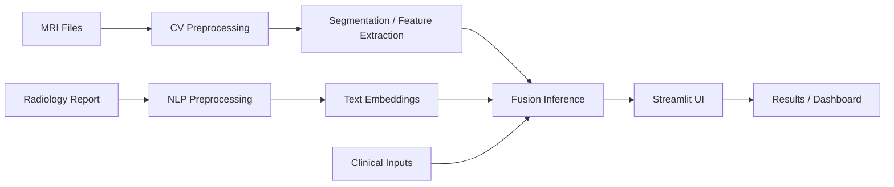

# CortexAI

CortexAI is a multimodal brain-tumor clinical decision support system implemented in Python. The project combines MRI-based segmentation, radiology-report NLP, multimodal fusion, and an interactive Streamlit UI to provide a research-oriented workflow for brain-tumor analysis and decision support.


[](https://www.python.org/)
[](https://pytorch.org/)
[](https://streamlit.io/)
[](LICENSE)

## Table of Contents

- [Project Overview](#project-overview)
- [Features](#features)
- [Screenshots](#screenshots)
- [Architecture](#architecture)
- [Folder Structure](#folder-structure)
- [Technologies Used](#technologies-used)
- [Installation](#installation)
- [Usage](#usage)
- [Configuration](#configuration)
- [Models](#models)
- [Dataset](#dataset)
- [Workflow](#workflow)
- [Dependencies](#dependencies)
- [Error Handling](#error-handling)
- [Future Improvements](#future-improvements)
- [Contributing](#contributing)
- [License](#license)
- [Authors](#authors)
- [Acknowledgments](#acknowledgments)
- [Contact](#contact)

## Project Overview

CortexAI was designed to support brain-tumor analysis by combining complementary information from:

- MRI volumes for segmentation and feature extraction
- Radiology report text for clinical-language embedding extraction
- Clinical-style feature inputs for multimodal fusion prediction

The repository contains both research-oriented notebooks and reusable Python modules for preprocessing, training, inference, evaluation, and a Streamlit-based interface.

### Main objectives

- Perform MRI-based segmentation using a 3D segmentation model
- Extract image features for downstream fusion
- Process radiology reports using transformer-based NLP components
- Fuse image, text, and clinical signals into a risk-style prediction workflow
- Expose the workflow through a polished Streamlit UI

### Intended users

- Researchers working on multimodal medical AI
- Students and teams presenting a graduation or academic project
- Developers interested in reusing the pipeline for inference and experimentation

## Features

- MRI preprocessing and inference support for 3D medical volumes
- Segmentation inference using a MONAI-based SegResNet checkpoint
- Image feature extraction for multimodal fusion
- Radiology report cleaning and embedding extraction with Hugging Face transformers
- Fusion-model inference combining image, text, and clinical inputs
- Streamlit-based home, prediction, results, and dashboard interface
- Dataset verification and setup utilities
- Evaluation and reporting assets under the reports directory

## Screenshots

The repository does not currently include saved screenshots, so the following placeholders mark the expected UI areas:

- Home page: placeholder for the landing experience
- Dashboard: placeholder for the project-status overview
- Prediction page: placeholder for MRI/report intake and inference controls
- Results page: placeholder for prediction summary and confidence views
- Analytics: placeholder for evaluation and reporting outputs
- Reports: placeholder for generated summaries and charts

## Architecture

The repository follows a modular pipeline:

1. MRI inputs are preprocessed and passed through the CV segmentation model.
2. Image features are extracted from the segmentation backbone.
3. Radiology text is cleaned and transformed into embeddings through the NLP module.
4. Image features, text features, and clinical inputs are combined by the fusion module.
5. The UI exposes the workflow for prediction and result presentation.



## Folder Structure

```text
CortexAI/
├── datasets/
│   ├── raw/
│   │   ├── brats2020/
│   │   └── TextBraTSData/
│   ├── processed/
│   ├── sample_data/
│   └── splits/
├── docs/
│   ├── architecture/
│   ├── presentation/
│   └── proposal/
├── models/
│   ├── fusion/
│   ├── nlp/
│   └── segmentation/
├── notebooks/
│   ├── cv/
│   ├── fusion/
│   └── nlp/
├── reports/
│   ├── evaluation/
│   ├── figures/
│   └── results/
├── scripts/
│   └── verify_nlp_module.py
├── src/
│   ├── cv_module/
│   ├── explainability/
│   ├── fusion_module/
│   ├── nlp_module/
│   ├── ui/
│   └── utils/
├── requirements.txt
├── LICENSE
└── README.md
```

### Important directories

- datasets/: raw and processed data directories used by the CV and NLP pipelines
- models/: trained or shipped model checkpoints and supporting artifacts
- notebooks/: experimentation and training notebooks for CV, NLP, and fusion work
- reports/: evaluation outputs, figures, and result artifacts
- src/: reusable implementation modules for the project

## Technologies Used

The codebase uses the following technologies and libraries:

- Python
- PyTorch
- MONAI
- Streamlit
- NumPy
- Pandas
- Scikit-learn
- Matplotlib
- Seaborn
- OpenCV
- Hugging Face Transformers
- SHAP

## Installation

### 1. Clone the repository

```bash
git clone https://github.com/nour-hossam7/CortexAI.git
cd CortexAI
```

### 2. Create and activate a virtual environment

```bash
python -m venv .venv
source .venv/bin/activate
```

On Windows PowerShell:

```powershell
python -m venv .venv
.\.venv\Scripts\Activate.ps1
```

### 3. Install dependencies

```bash
pip install -r requirements.txt
```

### 4. Prepare the data folders

The project expects locally available datasets in the raw data folders. The setup helper can create the expected directory structure:

```bash
python -m src.utils.setup_data
```

### 5. Run the Streamlit app

```bash
python -m streamlit run src/ui/app.py
```

## Usage

The main user workflow is:

1. Open the Streamlit app.
2. Upload MRI modality files for a case.
3. Paste or provide a radiology report.
4. Enter any required clinical inputs.
5. Run inference through the existing CV, NLP, and fusion pipeline.
6. Review the generated prediction, confidence, and case summary in the results view.

The UI currently expects the four MRI modalities used by the segmentation path and a report text input for the NLP feature extraction stage.

## Configuration

The repository uses module-level configuration files under the source tree:

- src/cv_module/config.py for MRI preprocessing, dataset paths, and model settings
- src/nlp_module/config.py for NLP dataset and embedding settings
- src/fusion_module/config.py for fusion model paths and clinical settings

No secrets or credentials are required by the current repository layout. The main runtime assumptions are local dataset availability and model checkpoints under the models directory.

## Models

The repository includes or expects the following trained artifacts:

- models/segmentation/best_model.pth: segmentation checkpoint used by the CV inference path
- models/fusion/best_decision_model.pth: fusion decision-model checkpoint
- models/fusion/clinical_scaler.pkl: scaler used by the fusion inference pipeline
- models/fusion/severity_thresholds.json: threshold values used by the fusion module

### Model approach

- The CV component uses a MONAI-style 3D SegResNet-based workflow for image segmentation and feature extraction.
- The NLP component uses transformer-based encoders to generate report embeddings.
- The fusion component combines image, text, and clinical features to produce a risk-style prediction.

### Inference workflow

- Load the segmentation model
- Preprocess the MRI input
- Generate a prediction mask and image features
- Extract report embeddings
- Run fusion inference and return a prediction with confidence values

## Dataset

The project is built around two main data sources:

- BraTS2020-style MRI data for the CV pipeline
- TextBraTS-style radiology report data for the NLP pipeline

Expected local locations:

- datasets/raw/brats2020/
- datasets/raw/TextBraTSData/

The repository also includes processed and split directories under datasets/processed and datasets/splits for downstream training and inference work.

## Workflow

The actual project workflow follows this path:

1. Input: MRI volumes and a radiology report
2. Preprocessing: normalize and structure the medical inputs for inference
3. Model: run segmentation and feature extraction, then NLP embedding extraction
4. Prediction: fuse the resulting signals into a decision output
5. Output: present the prediction, confidence, and supporting metadata in the Streamlit UI

## Dependencies

Key libraries and why they are used:

- PyTorch and TorchVision: model training and inference
- MONAI: 3D medical image preprocessing and segmentation workflow
- Streamlit: interactive user interface
- Transformers: text embedding extraction for radiology reports
- NumPy and Pandas: numerical processing and dataset handling
- Scikit-learn: preprocessing and model support utilities
- Matplotlib and Seaborn: plotting and evaluation outputs
- OpenCV: image processing support
- SHAP: explainability-related functionality in the project

## Performance

The repository includes evaluation-related artifacts in the reports directory, but no benchmark numbers are embedded in the README. Performance and validation outputs are expected to be reviewed from the reports and notebook outputs.

## Error Handling

The implementation includes basic validation and user-friendly error handling:

- The UI surfaces clear messages for missing files, empty reports, and incomplete inputs
- The NLP and inference modules raise informative exceptions when required inputs are missing or invalid
- Dataset setup utilities report whether expected raw and processed directories are present

## Future Improvements

Potential next steps for the project include:

- Add batch processing support for multiple patients
- Improve result export and report generation
- Add more detailed visualizations for segmentation and explanation outputs
- Containerize the application for easier deployment
- Add automated tests for the UI and inference modules

## Contributing

Contributions are welcome. If you would like to contribute:

1. Fork the repository
2. Create a feature branch
3. Make focused changes
4. Test the relevant modules or UI flow
5. Submit a pull request with a clear summary

Please keep the project structure and module boundaries intact when making changes.

## License

This project is licensed under the MIT License. See [LICENSE](LICENSE) for details.

## Authors

The repository documentation references the following project contributors:

- Nour Hossam
- Mariam Mohamed
- Ammar Kamal
- Ahmed Hossam
- Ibrahim Mahmoud

## Acknowledgments

This project builds on established tooling and datasets used in the medical AI and NLP community, including:

- BraTS2020-style MRI data
- TextBraTS-style radiology report data
- PyTorch, MONAI, Streamlit, and Hugging Face Transformers

## Contact

Repository links and project context are maintained in the repository itself. For direct project-related questions, use the repository issue tracker or contact the listed contributors through the project space.