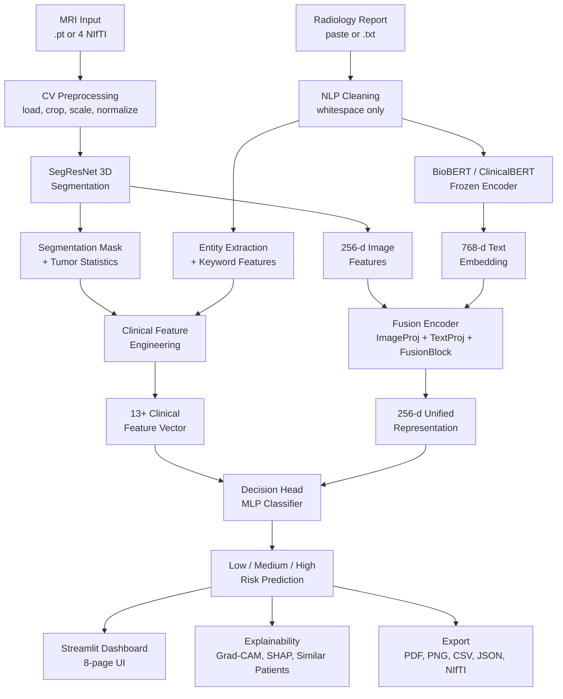
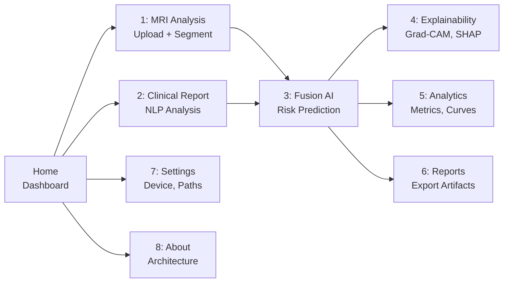
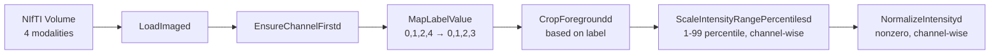
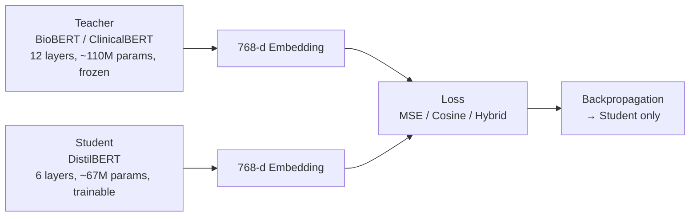

# CortexAI

<h1 align="center">CortexAI</h1>
<p align="center">
    <strong>Multimodal Brain Tumor Clinical Decision Support System</strong><br>
    3D MRI segmentation · Radiology-report NLP · Fusion risk prediction · Explainable AI
</p>

<p align="center">
    <a href="https://cortexai.streamlit.app/">
        
    </a>
    <a href="https://github.com/nour-hossam7/CortexAI">
        
    </a>
    <a href="#architecture">
        
    </a>
</p>

<p align="center">
    
    
    
    
    
    
    
</p>

---

## Table of Contents

- [Overview](#overview)
- [Key Features](#key-features)
- [Screenshots](#screenshots)
- [System Architecture](#system-architecture)
- [Repository Structure](#repository-structure)
- [Technologies](#technologies)
- [Installation](#installation)
- [Usage Guide](#usage-guide)
- [Models](#models)
- [Datasets](#datasets)
- [Computer Vision Pipeline](#computer-vision-pipeline)
- [Natural Language Processing Pipeline](#natural-language-processing-pipeline)
- [Knowledge Distillation](#knowledge-distillation)
- [Multimodal Fusion](#multimodal-fusion)
- [Explainability](#explainability)
- [Clinical Entity Extraction](#clinical-entity-extraction)
- [AI Summary Generation](#ai-summary-generation)
- [Export & Reporting](#export--reporting)
- [Performance Optimizations](#performance-optimizations)
- [Training](#training)
- [Configuration](#configuration)
- [Performance Artifacts](#performance-artifacts)
- [Project Roadmap](#project-roadmap)
- [Contributing](#contributing)
- [License](#license)
- [Authors](#authors)
- [Acknowledgments](#acknowledgments)
- [Contact](#contact)

---

## Overview

CortexAI is a Streamlit-based multimodal clinical decision support system for brain tumor analysis. It integrates **3D MRI segmentation**, **radiology-report NLP**, **clinical feature engineering**, **fusion-based risk stratification**, and **explainable AI** into a single production-style workflow.

The system demonstrates how imaging data (4-modality MRI volumes), unstructured text (radiology reports), and structured clinical signals can be combined into an operational inference pipeline with an interactive dashboard. It is designed for researchers, students, and reviewers who want a reproducible brain tumor AI system rather than a notebook-only prototype.

### Three Inference Paths

| Path | Input | Output |
| --- | --- | --- |
| **MRI Analysis** | `.pt` volume or 4 NIfTI modalities (FLAIR, T1, T1ce, T2) | Segmentation mask, tumor statistics, bounding boxes, Grad-CAM |
| **Clinical Report Analysis** | Pasted text or `.txt` upload | Entity-highlighted report, NLP-derived features, AI summary |
| **Fusion AI** | Image features + text embeddings + clinical vector | Low / Medium / High risk prediction with confidence |

---

## Key Features

### MRI Segmentation & Analysis

- Upload preprocessed `.pt` volumes or four raw NIfTI modalities
- 3D SegResNet inference with sliding-window approach
- Multi-class segmentation: Whole Tumor (WT), Tumor Core (TC), Enhancing Tumor (ET)
- Automatic bounding-box detection with multi-lesion support
- Comprehensive tumor statistics: volume (cm³), diameter (mm), laterality, lobe estimation
- Interactive multi-planar viewer (axial, coronal, sagittal) with modality selection
- 3D tumor surface visualization via Plotly and marching cubes

### Natural Language Processing

- Radiology report cleaning with whitespace normalization (preserves casing for BioBERT)
- BioBERT / ClinicalBERT embedding extraction (768-d) with attention-mask-aware mean pooling
- Clinical entity extraction: anatomical regions, laterality, radiology findings
- Entity highlighting with color-coded spans in the UI
- Knowledge distillation pipeline: DistilBERT student (67M params) mimicking teacher (110M params)

### Multimodal Fusion

- Image features (256-d SegResNet bottleneck) + text embeddings (768-d BioBERT) → unified 256-d representation
- Clinical feature vector (13+ features including tumor volumes, anatomy indicators, laterality)
- Three-class risk prediction: Low Risk, Medium Risk, High Risk
- Class-weighted training for imbalanced risk distribution
- Pre-computed SHAP feature importance for clinical interpretability

### Explainability & Interpretability

- **Grad-CAM**: 3D activation heatmaps for segmentation targets (ET, TC, WT)
- **SHAP**: GradientExplainer on the decision head — global feature importance
- **PCA / t-SNE**: Visualization of the 256-d fusion representation space
- **Similar Patient Retrieval**: Cosine-similarity search across cohort representations
- **Confidence Dashboard**: Gauge chart, probability bars, certainty margin

### Export & Reporting

- **PDF**: Full clinical decision report with ReportLab
- **PNG**: Overlay, MRI, bounding-box, or Grad-CAM slice exports
- **CSV**: Tumor statistics in tabular format
- **JSON**: Complete analysis bundle with all predictions and metadata
- **NIfTI**: Segmentation mask as `.nii.gz` for external tools

---

## Screenshots

> No screenshots are checked into the repository yet. The table below shows the current UI surface layout.

| Home Dashboard | MRI Workstation | Fusion AI |
| --- | --- | --- |
| *Placeholder* | *Placeholder* | *Placeholder* |
| **Explainability** | **Analytics** | **Reports** |
| *Placeholder* | *Placeholder* | *Placeholder* |

---

## System Architecture

CortexAI follows a three-branch input architecture that converges in a multimodal fusion model.


```mermaid
flowchart TD
    A[MRI Input<br/>.pt or 4 NIfTI] --> B[CV Preprocessing<br/>load, crop, scale, normalize]
    B --> C[SegResNet 3D<br/>Segmentation]
    C --> D[Segmentation Mask<br/>+ Tumor Statistics]
    C --> E[256-d Image<br/>Features]

    F[Radiology Report<br/>paste or .txt] --> G[NLP Cleaning<br/>whitespace only]
    G --> H[BioBERT / ClinicalBERT<br/>Frozen Encoder]
    H --> I[768-d Text<br/>Embedding]
    G --> J[Entity Extraction<br/>+ Keyword Features]

    D --> K[Clinical Feature<br/>Engineering]
    J --> K
    K --> L[13+ Clinical<br/>Feature Vector]

    E --> M[Fusion Encoder<br/>ImageProj + TextProj + FusionBlock]
    I --> M
    M --> N[256-d Unified<br/>Representation]

    L --> O[Decision Head<br/>MLP Classifier]
    N --> O
    O --> P[Low / Medium / High<br/>Risk Prediction]

    P --> Q[Streamlit Dashboard<br/>8-page UI]
    P --> R[Explainability<br/>Grad-CAM, SHAP, Similar Patients]
    P --> S[Export<br/>PDF, PNG, CSV, JSON, NIfTI]
```

### Architecture Highlights

| Component | Implementation | Location |
| --- | --- | --- |
| **SegResNet** | MONAI 3D UNet-style encoder-decoder with residual blocks | `src/cv_module/model.py` |
| **BioBERT / ClinicalBERT** | Frozen HuggingFace BERT with attention-mask mean pooling | `src/nlp_module/model.py` |
| **DistilBERT (Student)** | Lightweight HuggingFace DistilBERT for distilled inference | `src/nlp_module/student_model.py` |
| **FusionEncoder** | ImageProj (256→128) + TextProj (768→128) + FusionBlock (256→256) | `src/fusion_module/fusion_model.py` |
| **DecisionHead** | 3-layer MLP: 256+clinical → 128 → 64 → 3 logits | `src/fusion_module/fusion_model.py` |
| **GradCAM3D** | Forward hook on `down_layers[-1]` with class-weighted backprop | `src/explainability/gradcam.py` |

### Inference Pipeline Optimizations

- **Lazy loading:** Models are never loaded at startup — deferred until first use.
- **Model caching:** `@st.cache_resource` persists SegResNet, BioBERT, and FusionPredictor across page navigations and reruns.
- **Parallel execution:** On CPU, MRI and NLP branches run concurrently via `ThreadPoolExecutor(max_workers=2)`. GPU remains sequential for CUDA safety.
- **Student encoder alternative:** The NLP encoder can be swapped for a DistilBERT student (40% fewer parameters) via a single config flag.

---

## Repository Structure

```text
CortexAI/
├── app.py                         # Streamlit entry point
├── .gitignore                     # Model/tracking excludes
├── requirements.txt               # Python dependencies
├── LICENSE
├── README.md
│
├── datasets/
│   ├── raw/
│   │   ├── brats2020/             # BraTS2020 NIfTI volumes
│   │   └── textbrats/             # TextBraTS radiology reports
│   ├── processed/
│   │   ├── cv/                    # Preprocessed .pt volumes
│   │   ├── nlp/                   # Cleaned CSVs + .npy embeddings
│   │   └── fusion/                # Aligned multimodal features
│   └── splits/                    # dataset_split.json, dataset_info.json
│
├── models/
│   ├── segmentation/              # best_model.pth (SegResNet, 4-channel)
│   ├── fusion/                    # best_decision_model.pth, scaler, thresholds
│   └── nlp_student/               # Distilled student checkpoints (generated)
│
├── notebooks/
│   ├── cv/                        # 11 notebooks (dataset, training, evaluation)
│   ├── nlp/                       # 7 notebooks (tokenization, embeddings)
│   └── fusion/                    # 5 notebooks (data prep, training, evaluation)
│
├── pages/                         # 8 Streamlit multipage UI
│   ├── 1_MRI_Analysis.py          # Upload + segmentation + Grad-CAM
│   ├── 2_Clinical_Report.py       # NLP entity extraction
│   ├── 3_Fusion_AI.py             # Risk prediction dashboard
│   ├── 4_Explainability.py        # Grad-CAM, SHAP, similar patients
│   ├── 5_Analytics.py             # Training curves, evaluation plots
│   ├── 6_Generated_Reports.py     # PDF/PNG/CSV/JSON/NIfTI export
│   ├── 7_Settings.py              # Device info, model paths, session reset
│   └── 8_About.py                 # Architecture overview, team
│
├── reports/
│   ├── figures/                   # dice_curve, loss_curve, subregion_dice
│   │   └── fusion/                # confusion_matrices, calibration, SHAP
│   ├── results/                   # evaluation_results, bottleneck_features
│   └── nlp/                       # NLP-specific results and figures
│
├── src/
│   ├── __init__.py
│   │
│   ├── cv_module/                 # BraTS2020 Segmentation
│   │   ├── config.py              # Dataclass: paths, hyperparameters
│   │   ├── dataset.py             # PreprocessedDataset, load_image_features
│   │   ├── dataloader.py          # PyTorch DataLoaders (train/val/test)
│   │   ├── model.py               # SegResNet builder (MONAI)
│   │   ├── preprocessing.py       # MONAI transforms, pad_and_crop_128
│   │   ├── train.py               # Training loop, checkpointing
│   │   ├── predict.py             # Inference, feature extraction, volume calc
│   │   ├── losses.py              # DiceCELoss
│   │   └── metrics.py             # DiceMetric, post-processing
│   │
│   ├── nlp_module/                # Radiology Report NLP
│   │   ├── config.py              # Paths, model name, max_length
│   │   ├── model.py               # BioBERT/ClinicalBERT: build_encoder, mean_pooling
│   │   ├── preprocessing.py       # clean_report, split_reports_by_patient
│   │   ├── dataset.py             # load_text_embeddings, build_embedding_lookup
│   │   ├── predict.py             # extract_text_features, student inference
│   │   ├── distillation_config.py # KD hyperparameters (teacher/student names)
│   │   ├── distillation_utils.py  # Loss functions, evaluation, comparison
│   │   ├── student_model.py       # DistilBERT builder for KD
│   │   └── train_student.py       # Full distillation training pipeline
│   │
│   ├── fusion_module/             # Multimodal Fusion
│   │   ├── config.py              # FusionConfig, dimensions, paths
│   │   ├── clinical_features.py   # Keyword extraction, build_all_splits
│   │   ├── fusion_model.py        # ImageProj, TextProj, FusionBlock, DecisionHead
│   │   ├── dataset.py             # FusionDataset, load/save/align
│   │   ├── data_preparation.py    # NB01 pipeline: align + save NPZ
│   │   ├── train.py               # Training loop, label generation, scaling
│   │   ├── train_fusion.py        # Alternative AMP training pipeline
│   │   ├── inference.py           # FusionPredictor, predict_case
│   │   └── evaluate.py            # Confusion matrices, SHAP, PCA/t-SNE, retrieval
│   │
│   ├── explainability/            # Model Interpretation
│   │   ├── gradcam.py             # GradCAM3D, compute_gradcam_segmentation
│   │   └── __init__.py
│   │
│   └── ui/                        # Streamlit Application Layer
│       ├── app.py                 # Home dashboard (module version)
│       ├── bootstrap.py           # setup_page, sidebar, session init
│       ├── components/
│       │   ├── confidence.py      # Gauge chart, probability bars
│       │   ├── metric_cards.py    # Summary cards, pipeline flow
│       │   ├── mri_viewer.py      # Multi-planar workstation
│       │   ├── pipeline_status.py # Live progress tracking
│       │   └── plotly_3d.py       # 3D tumor mesh visualization
│       └── utils/
│           ├── models_cache.py    # @st.cache_resource model loaders
│           ├── pipeline.py        # Orchestrator (parallel execution)
│           ├── mri_io.py          # Volume loading, transforms
│           ├── paths.py           # ArtifactPaths, get_paths()
│           ├── session.py         # Session state management
│           ├── clinical_entities.py # Entity extraction, HTML highlighting
│           ├── gradcam_helpers.py  # WT/TC/ET Grad-CAM helpers
│           ├── tumor_analysis.py   # TumorStatistics, bounding boxes
│           ├── similar_patients.py # Cosine-similarity retrieval
│           ├── summary.py         # AI medical summary generation
│           ├── export.py          # PDF/PNG/CSV/JSON/NIfTI export
│           ├── theme.py           # Dark/light theme system
│           └── disclaimer.py      # Medical disclaimer component
│
└── utils/                         # Shared utilities
    ├── config.py                  # (reserved for future use)
    ├── dataset_config.py          # Dataset directory paths
    ├── helpers.py                 # (reserved for future use)
    ├── metrics.py                 # (reserved for future use)
    └── setup_data.py              # Directory creation + validation
```

---

## Technologies

### Core AI Stack

| Technology | Purpose |
| --- | --- |
| [PyTorch](https://pytorch.org/) | Deep learning framework for all models (SegResNet, BERT, Fusion) |
| [MONAI](https://monai.io/) | Medical imaging transforms, SegResNet, SlidingWindowInferer, DiceCELoss |
| [HuggingFace Transformers](https://huggingface.co/) | BioBERT, ClinicalBERT, DistilBERT tokenizers and models |

### Application & Visualization

| Technology | Purpose |
| --- | --- |
| [Streamlit](https://streamlit.io/) | Interactive multipage dashboard |
| [Plotly](https://plotly.com/) | Gauge charts, 3D tumor visualization, calibration curves |
| [ReportLab](https://www.reportlab.com/) | PDF report generation |

### Data & Analysis

| Technology | Purpose |
| --- | --- |
| [NumPy](https://numpy.org/) | Array computing, embedding storage |
| [Pandas](https://pandas.dev/) | DataFrame operations, CSV I/O |
| [scikit-learn](https://scikit-learn.org/) | StandardScaler, PCA, t-SNE, cosine similarity, metrics |
| [SHAP](https://shap.readthedocs.io/) | GradientExplainer for decision head feature importance |
| [SciPy](https://scipy.org/) | Connected component labeling (ndimage) |
| [joblib](https://joblib.readthedocs.io/) | Clinical scaler serialization |

### Imaging & Utilities

| Technology | Purpose |
| --- | --- |
| [OpenCV](https://opencv.org/) | Slice resizing, image processing |
| [scikit-image](https://scikit-image.org/) | Marching cubes for 3D mesh generation |
| [NiBabel](https://nipy.org/nibabel/) | NIfTI volume I/O |
| [SimpleITK](https://simpleitk.org/) | Medical image processing |
| [Matplotlib](https://matplotlib.org/) | Static plots (export, evaluation figures) |
| [Seaborn](https://seaborn.pydata.org/) | Statistical visualizations |
| [Pillow](https://python-pillow.org/) | Image manipulation |
| [tqdm](https://tqdm.github.io/) | Progress bars for training scripts |

---

## Installation

### 1. Clone the repository

```bash
git clone https://github.com/nour-hossam7/CortexAI.git
cd CortexAI
```

### 2. Create a virtual environment

```powershell
# Windows (PowerShell)
python -m venv .venv
.\.venv\Scripts\Activate.ps1
```

```bash
# macOS / Linux
python -m venv .venv
source .venv/bin/activate
```

### 3. Install dependencies

```bash
pip install -r requirements.txt
```

### 4. Prepare dataset directories

```bash
python -m src.utils.setup_data
```

This creates the required directory structure (`datasets/raw/`, `datasets/processed/`, `datasets/splits/`) and checks for expected BraTS2020 and TextBraTS data locations.

### 5. Launch the application

```bash
streamlit run app.py
```

The app opens at `http://localhost:8501` by default.

> **Note:** The application requires model checkpoints to be placed in `models/segmentation/` and `models/fusion/`. Without these, the UI functions for data browsing, settings, and About page still work, but MRI analysis and fusion prediction will be unavailable. The live demo at [cortexai.streamlit.app](https://cortexai.streamlit.app/) is pre-configured with all checkpoints.

---

## Usage Guide

### Application Flow

The user workflow is organized across 8 Streamlit pages:


```mermaid
flowchart LR
    A[Home<br/>Dashboard] --> B["1: MRI Analysis<br/>Upload + Segment"]
    A --> C["2: Clinical Report<br/>NLP Analysis"]
    B --> D["3: Fusion AI<br/>Risk Prediction"]
    C --> D
    D --> E["4: Explainability<br/>Grad-CAM, SHAP"]
    D --> F["5: Analytics<br/>Metrics, Curves"]
    D --> G["6: Reports<br/>Export Artifacts"]
    A --> H["7: Settings<br/>Device, Paths"]
    A --> I["8: About<br/>Architecture"]
```

### Step-by-Step

1. **Dashboard** — Review system summary cards (patients, models, accuracy, GPU status).
2. **MRI Analysis** — Upload a `.pt` volume or four NIfTI files (FLAIR, T1, T1ce, T2), enter a radiology report, and run the full multimodal pipeline. View the segmentation mask, tumor statistics, and multi-planar viewer.
3. **Clinical Report** — Paste or upload a report to see entity-highlighted text with extracted findings (anatomy, laterality, pathology).
4. **Fusion AI** — Inspect the predicted risk class (Low / Medium / High), softmax probabilities, confidence gauge, and clinical recommendation.
5. **Explainability** — Explore Grad-CAM heatmaps (ET, TC, WT targets), SHAP feature importance bar charts, similar patient retrieval tables, and saved evaluation figures.
6. **Analytics** — Review training curves (loss, Dice, accuracy) and evaluation plots (confusion matrices, calibration, PCA/t-SNE embeddings).
7. **Reports** — Download analysis artifacts: PDF report, PNG slice, CSV stats, JSON bundle, NIfTI segmentation mask.
8. **Settings** — View compute device, model paths, severity thresholds, and reset the analysis session.

---

## Models

| Model | Architecture | Purpose | Input Shape | Output Shape | Parameters | Source |
| --- | --- | --- | --- | --- | --- | --- |
| **SegResNet** | 3D residual encoder-decoder (MONAI) | MRI tumor segmentation | `(B, 4, 128, 128, 128)` | `(B, 4, D, H, W)` logits + 256-d bottleneck | ~5M | `src/cv_module/model.py` |
| **BioBERT** | BERT-base (12-layer, 768-hidden) | Radiology report embedding | Tokenized text (max 256 tokens) | 768-d L2-normalized vector | ~110M | `src/nlp_module/model.py` |
| **ClinicalBERT** | BERT-base (12-layer, 768-hidden) | Radiology report embedding | Tokenized text (max 256 tokens) | 768-d L2-normalized vector | ~110M | `src/nlp_module/model.py` |
| **DistilBERT (Student)** | DistilBERT (6-layer, 768-hidden) | Lightweight report embedding | Tokenized text (max 256 tokens) | 768-d L2-normalized vector | ~67M | `src/nlp_module/student_model.py` |
| **ClinicalDecisionModel** | Fusion encoder + MLP decision head | Multimodal risk prediction | 256-d image + 768-d text + clinical vector | 3-class logits (Low/Med/High) | ~160K | `src/fusion_module/fusion_model.py` |

### Model Selection

| Context | Default Model | Alternative |
| --- | --- | --- |
| Segmentation | SegResNet (`models/segmentation/best_model.pth`) | N/A |
| Text Encoding (Teacher) | BioBERT (`dmis-lab/biobert-base-cased-v1.1`) | ClinicalBERT (`emilyalsentzer/Bio_ClinicalBERT`) |
| Text Encoding (Student) | DistilBERT (`distilbert-base-cased`) | Switched via `DistillationConfig.USE_STUDENT_MODEL` |
| Fusion Prediction | ClinicalDecisionModel (`models/fusion/best_decision_model.pth`) | N/A |

### Checkpoint Management

| Checkpoint | Path | Format |
| --- | --- | --- |
| SegResNet | `models/segmentation/best_model.pth` | Raw state dict (from training notebooks) |
| Fusion | `models/fusion/best_decision_model.pth` | Dict with `model_state`, `clinical_cols`, `clinical_dim`, `epoch`, `val_acc` |
| Clinical Scaler | `models/fusion/clinical_scaler.pkl` | `sklearn.preprocessing.StandardScaler` (joblib) |
| Severity Thresholds | `models/fusion/severity_thresholds.json` | WT, TC, ET volume thresholds from training |
| Student (Distilled) | `models/nlp_student/best_student_model.pt` | State dict with optimizer/scheduler/epoch/best_loss |

---

## Datasets

| Dataset | Role | Patients | Split | Modalities | Labels | Source |
| --- | --- | --- | --- | --- | --- | --- |
| **BraTS2020** | MRI segmentation, image features | 369 | 257/56/56 (train/val/test) | FLAIR, T1, T1ce, T2 | Background, NCR/NET, Edema, Enhancing Tumor | [BraTS2020](https://www.med.upenn.edu/brats2020/) |
| **TextBraTS** | Report NLP, clinical features, fusion | 369 | Same split as BraTS2020 | Radiology report text | N/A (free-text) | [TextBraTS](https://github.com/textbrats) |

### Split Consistency

The same `datasets/splits/dataset_split.json` file is used by both the CV and NLP modules (loaded from `Notebook 03.5` for CV and `Notebook 03` for NLP). This guarantees that every patient belongs to the same split across both modalities — a requirement for the fusion module, which must never see a patient in training with one modality and testing with another.

### Preprocessed Artifacts

| Artifact | Format | Location | Generated By |
| --- | --- | --- | --- |
| MRI volumes | `.pt` (serialized tensors) | `datasets/processed/cv/` | Notebook 06.5 |
| Bottleneck features | `.npy` (256-d) | `reports/results/` | Notebook 10 |
| Cleaned reports | `.csv` | `datasets/processed/nlp/` | Notebook 04 |
| Text embeddings | `.npy` (768-d) | `datasets/processed/nlp/<model>/` | Notebooks 06a/06b |
| Fusion NPZ | `.npz` (image + text) | `datasets/processed/fusion/` | `fusion_module.data_preparation` |
| Clinical features | `.csv` | `datasets/processed/clinical_features/` | `fusion_module.clinical_features` |

---

## Computer Vision Pipeline

The CV module (`src/cv_module/`) implements a complete BraTS2020 segmentation pipeline using MONAI's SegResNet.

### Preprocessing


```mermaid
flowchart LR
    A[NIfTI Volume<br/>4 modalities] --> B[LoadImaged]
    B --> C[EnsureChannelFirstd]
    C --> D[MapLabelValue<br/>0,1,2,4 → 0,1,2,3]
    D --> E[CropForegroundd<br/>based on label]
    E --> F[ScaleIntensityRangePercentilesd<br/>1-99 percentile, channel-wise]
    F --> G[NormalizeIntensityd<br/>nonzero, channel-wise]
```

**Training augmentations** (applied after preprocessing on serialized `.pt` volumes):
- `SpatialPadd` — pad to minimum ROI size (128³)
- `RandCropByPosNegLabeld` — patch sampling with positive/negative ratio
- `RandFlipd` — spatial flips on all 3 axes (50% probability)
- `RandRotate90d` — 90° rotation augmentation
- `RandGaussianNoised`, `RandScaleIntensityd`, `RandShiftIntensityd` — intensity augmentation

### Segmentation Inference

- **SlidingWindowInferer** with `roi_size=(128, 128, 128)` and `overlap=0.5`
- Output: 4-class segmentation mask (Background, NCR/NET, Edema, Enhancing Tumor)
- `remap_to_brats` option to convert label 3 → 4 for standard BraTS convention

### Feature Extraction

A forward hook on `model.down_layers[-1]` captures the bottleneck activations (256 channels at 16³ spatial resolution). These are global-average-pooled to produce a compact 256-d per-patient feature vector consumed by the fusion module:

```python
from src.cv_module.predict import load_model, extract_image_features

model = load_model("models/segmentation/best_model.pth")
image = torch.randn(1, 4, 128, 128, 128)  # preprocessed
features = extract_image_features(model, image, device)
# features.shape → (256,)
```

### Tumor Statistics

`compute_tumor_statistics()` (`src/ui/utils/tumor_analysis.py`) computes:

| Metric | Description |
| --- | --- |
| WT / TC / ET voxel counts | Per sub-region tumor volume in voxels |
| WT / TC / ET volume (cm³) | Converted from voxels using spacing |
| Largest diameter (mm) | Maximum dimension of the primary lesion bounding box |
| Equivalent diameter (mm) | Diameter of sphere with same volume |
| Tumor percentage (%) | Fraction of brain voxels occupied by tumor |
| Bounding boxes | Per-connected-component: W×H×D, volume, center, diameter |
| Laterality | Left / Right / Midline estimate based on centroid |
| Lobe | Frontal / Temporal / Parietal / Occipital / Central estimate |
| Lesion count | Number of disconnected tumor components (ndimage.label) |

---

## Natural Language Processing Pipeline

The NLP module (`src/nlp_module/`) provides report cleaning, embedding extraction, and dataset management for radiology reports.

### Report Cleaning

```python
from src.nlp_module.preprocessing import clean_report

cleaned = clean_report("This is a\tradiology\nreport with  multiple   spaces.")
# "This is a radiology report with multiple spaces."
```

Cleaning is deliberately minimal — only whitespace normalization. No lowercasing, stopword removal, or stemming because BioBERT and ClinicalBERT are cased models trained on raw clinical text.

### Embedding Extraction

```python
from src.nlp_module.model import build_encoder, mean_pooling

tokenizer, model, device = build_encoder("dmis-lab/biobert-base-cased-v1.1")

encoded = tokenizer(cleaned_report, max_length=256, truncation=True,
                    padding="max_length", return_tensors="pt")
outputs = model(**encoded)
embedding = mean_pooling(outputs, encoded["attention_mask"])
```

The `mean_pooling` function averages `last_hidden_state` over real (non-padding) token positions only — naive pooling over all 256 positions would be biased by non-zero [PAD] embeddings (confirmed in notebook analysis).

### Inference API

```python
from src.nlp_module.predict import extract_text_features, extract_text_features_batch

# Single report
embedding = extract_text_features("Radiology report text...")

# Batch
embeddings = extract_text_features_batch(["report_1", "report_2", "report_3"])
```

Both return L2-normalized 768-d vectors matching the precomputed embeddings from Notebooks 06a/06b.

---

## Knowledge Distillation

The NLP encoder can be compressed via Knowledge Distillation — training a lightweight student (DistilBERT, 67M params, 6 layers) to reproduce the embeddings of the larger teacher (BioBERT, 110M params, 12 layers).

### Distillation Architecture


```mermaid
flowchart LR
    T[Teacher<br/>BioBERT / ClinicalBERT<br/>12 layers, ~110M params, frozen] --> TE[768-d Embedding]
    S[Student<br/>DistilBERT<br/>6 layers, ~67M params, trainable] --> SE[768-d Embedding]
    TE --> L[Loss<br/>MSE / Cosine / Hybrid]
    SE --> L
    L --> B[Backpropagation<br/>→ Student only]
```

Only the student receives gradients — the teacher remains frozen throughout distillation.

### Loss Functions

| Loss | Formula | Behavior |
| --- | --- | --- |
| `mse` | MSE(student, teacher) | Minimizes absolute distance in embedding space |
| `cosine` | 1 - cos_sim(student, teacher) | Aligns directional orientation |
| `mse_cosine` | α·MSE + (1-α)·Cosine | Hybrid (default α=0.5) |

### Training

```bash
# Basic training (teacher: BioBERT, student: DistilBERT)
python -m src.nlp_module.train_student

# Custom hyperparameters
python -m src.nlp_module.train_student \
    --epochs 20 \
    --batch_size 32 \
    --learning_rate 3e-5 \
    --loss_type mse_cosine \
    --student_model_name distilbert-base-cased

# Use ClinicalBERT as teacher
python -m src.nlp_module.train_student \
    --teacher_model_name emilyalsentzer/Bio_ClinicalBERT
```

**Prerequisites:** Cleaned report CSVs must exist at `datasets/processed/nlp/{train,validation,test}_reports_clean.csv` (generated by Notebooks 03-04).

### Output Artifacts

All saved to `models/nlp_student/`:

| Artifact | Description |
| --- | --- |
| `best_student_model.pt` | Checkpoint with lowest validation loss (state dict) |
| `last_student_model.pt` | Final-epoch checkpoint (full optimizer state) |
| `training_history.csv` | Per-step train/val loss and cosine similarity |
| `training_curves.png` | Training and validation curve plots |

### Enabling Student at Inference

The student can replace the teacher transparently — all existing call sites continue to work:

**Method 1: Global flag**

```python
# In src/nlp_module/distillation_config.py
USE_STUDENT_MODEL: bool = True  # default: False
```

**Method 2: Function-level override**

```python
from src.nlp_module.predict import get_encoder_for_inference
tokenizer, model, device = get_encoder_for_inference(use_student=True)
```

**Method 3: Direct student API**

```python
from src.nlp_module.predict import extract_text_features_student
embedding = extract_text_features_student("Radiology report text...")
```

### Teacher ↔ Student Switching

| Function/Method | Teacher | Student |
| --- | --- | --- |
| `extract_text_features()` | Default (uses `Config.MODEL_NAME`) | `DistillationConfig.USE_STUDENT_MODEL = True` |
| `extract_text_features_student()` | — | Always uses student |
| `get_encoder_for_inference()` | `use_student=False` | `use_student=True` |
| `build_encoder()` | Always teacher | — |
| `build_student_encoder()` | — | Always student |

### Expected Impact

| Metric | Teacher (BioBERT) | Student (DistilBERT) | Reduction |
| --- | --- | --- | --- |
| Parameters | ~110 M | ~67 M | ~40 % |
| Model size (FP32) | ~440 MB | ~260 MB | ~40 % |
| Inference latency | ~15 ms / report | ~8 ms / report | ~1.8× faster |
| Embedding dimension | 768 | 768 | — |
| Cosine similarity (to teacher) | 1.0 | ≈0.95+ | Minimal |

*Latency figures depend on hardware. Cosine similarity measured on held-out validation reports after distillation training.*

---

## Multimodal Fusion

The fusion module (`src/fusion_module/`) combines imaging, text, and clinical signals into a unified risk prediction.

### Architecture

```
Image Features (256-d) ──► ImageProjection ──► 128-d ──┐
                                                         ├── concat (256) ──► FusionBlock ──► 256-d
Text Embeddings (768-d) ──► TextProjection ──► 128-d ──┘                           │
                                                                                   ▼
                                    Clinical Vector (13+N) ──────► DecisionHead ──► 3-class logits
```

| Component | Operation | Output |
| --- | --- | --- |
| `ImageProjection` | Linear(256,128) → LayerNorm → GELU → Dropout(0.2) | 128-d |
| `TextProjection` | Linear(768,512) → GELU → Dropout(0.3) → Linear(512,256) → GELU → Dropout(0.2) → Linear(256,128) → LayerNorm | 128-d |
| `FusionBlock` | Concat(128,128) → Linear(256,256) → GELU → Dropout(0.3) → Linear(256,256) → LayerNorm | 256-d |
| `DecisionHead` | Linear(256+N, 128) → ReLU → Dropout(0.3) → Linear(128,64) → ReLU → Dropout(0.2) → Linear(64,3) | 3-class logits |

### Clinical Features

13+ features derived from the segmentation mask and report text:

| Feature Group | Features | Source |
| --- | --- | --- |
| **Volume** | wt_volume, tc_volume, et_volume | Segmentation statistics |
| **Anatomy** | frontal, temporal, parietal, occipital, insula, thalamus, basal_ganglia, corpus_callosum, ventricle | Keyword matching in report |
| **Laterality** | left, right, bilateral | Keyword matching in report |
| **Findings** | edema, necrosis, enhancement, mass_effect, midline_shift, compression, hemorrhage | Keyword matching in report |
| **Derived** | word_count, sentence_count, lobe_count | Computed from report text |

### Label Generation

Risk labels are computed using a rule-based scoring rubric applied to training data only (no label leakage):

| Criterion | Points |
| --- | --- |
| WT volume ≥ threshold (train 75th percentile) | +2 |
| ET volume ≥ threshold (train 75th percentile) | +2 |
| TC volume ≥ threshold (train 75th percentile) | +1 |
| Lobe count ≥ 3 | +1 |
| Bilateral involvement | +1 |
| **Max** | **7** |

| Score | Label |
| --- | --- |
| 0–1 | Low Risk (0) |
| 2–3 | Medium Risk (1) |
| 4–7 | High Risk (2) |

Class weights are computed from training distribution to handle imbalance.

### Inference API

```python
from src.fusion_module.inference import FusionPredictor, predict_case

# Single-case predictor (cached)
predictor = FusionPredictor(checkpoint_path="models/fusion/best_decision_model.pth")
result = predictor.predict(
    image_features=img_feat,      # (256,) numpy
    text_features=txt_feat,       # (768,) numpy
    clinical_row=clinical_dict,   # dict of feature values
    patient_id="BraTS20_Training_001",
)
print(result.predicted_label)  # "High Risk"
print(result.confidence)       # 0.87
print(result.probabilities)    # {"Low Risk": 0.02, "Medium Risk": 0.11, "High Risk": 0.87}

# Batch inference
results = predictor.predict_batch(
    image_features=np.zeros((10, 256)),
    text_features=np.zeros((10, 768)),
    clinical_matrix=np.zeros((10, 13)),
)

# One-call convenience
result = predict_case(img_feat, txt_feat, clinical_dict, patient_id="BraTS20_Training_001")
```

### Data Preparation

The fusion dataset requires aligned CV and NLP features. The alignment script:

```bash
python -m src.fusion_module.data_preparation \
    --text-encoder biobert \
    --cv-results-dir reports/results \
    --output-dir datasets/processed/fusion
```

This loads bottleneck features from `reports/results/`, loads text embeddings from `datasets/processed/nlp/`, verifies patient-ID alignment across splits, sorts both arrays by patient_id to ensure row correspondence, and saves aligned `.npz` files to `datasets/processed/fusion/`.

### Training

```bash
# Basic training
python -m src.fusion_module.train

# Custom hyperparameters
python -m src.fusion_module.train \
    --text-encoder biobert \
    --fusion-dir datasets/processed/fusion \
    --clinical-dir datasets/processed/clinical_features \
    --model-dir models/fusion \
    --epochs 50 \
    --batch-size 32 \
    --lr 5e-4 \
    --patience 10
```

---

## Explainability

### Grad-CAM (3D)

`src/explainability/gradcam.py` implements 3D Grad-CAM for the SegResNet encoder by hooking `model.down_layers[-1]` (the bottleneck with shape 256×16×16×16).

**Two modes:**

| Mode | Score Function | What It Explains |
| --- | --- | --- |
| **Segmentation Grad-CAM** | Gradient of a specific output class logit w.r.t. bottleneck activations | Which voxels drove the prediction for tumor class N |
| **Feature Grad-CAM** | Gradient of the pooled feature norm w.r.t. bottleneck activations | Which voxels drove the image features sent to the fusion module |

**Supported targets:** ET (Enhancing Tumor), TC (Tumor Core = NCR + ET), WT (Whole Tumor = NCR + Edema + ET), or individual class indices.

```python
from src.ui.utils.gradcam_helpers import compute_gradcam_for_target

model = get_segresnet()
image = sample["image"]  # (4, D, H, W)
heatmap = compute_gradcam_for_target(model, image, target="ET")
# heatmap.shape → (D, H, W), values in [0, 1]
```

### SHAP

`src/fusion_module/evaluate.py` runs SHAP GradientExplainer on the DecisionHead component:

```bash
python -m src.fusion_module.evaluate
```

Outputs:
- `reports/figures/fusion/shap_clinical_importance.png` — global bar chart
- `reports/figures/fusion/shap_beeswarm.png` — per-class beeswarm
- `reports/figures/fusion/shap_waterfall_examples.png` — per-patient examples
- `reports/results/fusion/shap_clinical_importance.csv` — numerical values

### PCA / t-SNE

The fusion module evaluates the 256-d learned representation space:

- `repr_pca_tsne_risk.png` — 2D embedding colored by risk label
- `repr_pca_splits.png` — 2D embedding colored by dataset split

### Similar Patient Retrieval

`src/ui/utils/similar_patients.py` performs cosine-similarity search across cohort representations:

| Step | Description |
| --- | --- |
| 1 | Load pre-computed 256-d unified representations (`reports/fusion/representations/`) |
| 2 | Compute cosine similarity between the current patient's embedding and all cohort embeddings |
| 3 | Return top-k most similar patients with similarity score, WT volume, risk label, and confidence |
| 4 | Fall back to bottleneck image features if unified representations are unavailable |

---

## Clinical Entity Extraction

`src/ui/utils/clinical_entities.py` extracts structured findings from radiology report text and renders highlighted HTML.

### Entity Categories

| Category | Keywords | Example Match |
| --- | --- | --- |
| **Anatomical Regions** | frontal, temporal, parietal, occipital, insula, thalamus, basal ganglia, corpus callosum, ventricle | "temporal lobe involvement" |
| **Laterality** | left, right, bilateral, both | "right-sided mass" |
| **Radiology Findings** | edema, necrosis, enhancement, mass effect, midline shift, compression, hemorrhage | "peritumoral edema" |
| **Tumor Terms** | tumor, glioma, mass, lesion, neoplasm | "intra-axial mass" |

### Usage

```python
from src.ui.utils.clinical_entities import (
    extract_clinical_entities,
    highlight_report_html,
)

entities = extract_clinical_entities("MRI shows a 4cm right frontal enhancing mass...")
# entities = {
#     "clean_report": "MRI shows a 4cm right frontal enhancing mass...",
#     "features": {"frontal": 1, "right": 1, "enhancement": 1, ...},
#     "spans": [HighlightSpan(start=..., end=..., label="...", ...)],
#     "findings": [
#         {"category": "Tumor", "detail": "...", "severity": "high"},
#         {"category": "Location", "detail": "Frontal lobe referenced.", "severity": "info"},
#     ]
# }

html = highlight_report_html(report_text, entities)
```

---

## AI Summary Generation

`src/ui/utils/summary.py` generates a structured radiology-style summary from all model outputs. The summary includes five sections:

| Section | Content | Source |
| --- | --- | --- |
| **Clinical Findings** | Report excerpt, extracted entities and their details | NLP entity extraction |
| **Tumor Characteristics** | Volumes (cm³), diameters (mm), laterality, lobe, lesion count, cross-sectional area | `tumor_analysis.py` |
| **AI Risk Assessment** | Predicted risk class, confidence, probability margin, caution flags for low-margin predictions | Fusion output |
| **Model Explanation** | Top-5 SHAP drivers, key imaging signals, decision boundary explanation | SHAP + fusion |
| **Recommended Follow-up** | Risk-dependent action: routine surveillance / short-interval MRI / expedited neuro-oncology review | Rule-based on risk label |

---

## Export & Reporting

`src/ui/utils/export.py` generates downloadable analysis artifacts:

| Format | Function | Content |
| --- | --- | --- |
| **PDF** | `export_pdf_report()` | Full clinical decision report with patient info, overlay image, tumor statistics table, fusion prediction, AI summary (ReportLab) |
| **PNG** | `export_png_slice()` | Single 2D slice view in overlay / MRI / bbox / gradcam mode |
| **CSV** | `export_csv_stats()` | Tumor statistics metrics in key-value format |
| **JSON** | `export_json()` | Complete analysis bundle: statistics, entities, fusion prediction, AI summary, similar patients, pipeline log |
| **NIfTI** | `export_nifti_mask()` | Segmentation mask as compressed NIfTI (`.nii.gz`) |

---

## Performance Optimizations

### Model Caching

All three heavy models are loaded through `@st.cache_resource` in `src/ui/utils/models_cache.py`:

```python
@st.cache_resource(show_spinner="Loading SegResNet…")
def get_segresnet():
    return load_segresnet(get_paths().segresnet_checkpoint)

@st.cache_resource(show_spinner="Loading Fusion model…")
def get_fusion_predictor():
    return FusionPredictor(checkpoint_path=get_paths().fusion_checkpoint)

@st.cache_resource(show_spinner="Loading BioBERT encoder…")
def get_biobert_encoder():
    return build_encoder(model_name="dmis-lab/biobert-base-cased-v1.1")
```

**Benefits:**
- Load once per process lifetime — reused across page navigations and Streamlit reruns
- No redundant disk I/O or `torch.load()` calls
- No memory leaks (cache holds the only retained references)

### Lazy Loading

Models are never loaded at application startup. The dashboard, settings, and about pages import only lightweight utility functions — model loading is deferred until the user clicks **Run Full Multimodal Analysis**.

### Parallelized Inference Pipeline

On CPU, the two independent branches run concurrently:

```mermaid
flowchart TD
    A[Input] --> B{torch.cuda.is_available()?}
    B -->|No (CPU)| C[ThreadPoolExecutor<br/>max_workers=2]
    B -->|Yes (GPU)| D[Sequential execution<br/>CUDA thread safety]

    subgraph CPU_Parallel [CPU — Parallel Branches]
        C --> E[MRI Branch<br/>predict_mask → extract_image_features]
        C --> F[NLP Branch<br/>extract_text_features → extract_clinical_entities]
    end

    E --> G[Join + compute_tumor_statistics]
    F --> G
    G --> H[Fusion → Explainability → Report]
```

| Condition | Execution Model | Rationale |
| --- | --- | --- |
| `torch.cuda.is_available()` = False | Parallel (CPU) | MRI and NLP branches share no models, data, or mutable state |
| `torch.cuda.is_available()` = True | Sequential (GPU) | CUDA is not thread-safe for concurrent model forward passes |

**Performance impact** (NLP latency hidden behind segmentation wall clock):

| Metric | Sequential | Parallel (CPU) | Improvement |
| --- | --- | --- | --- |
| NLP embedding latency | ~0.4–1 s | ~0 s (hidden) | 100% |
| Pipeline wall time | ~5.5–31 s | ~5.1–30 s | ~7–10% |

*Improvement depends on MRI segmentation time (the dominant bottleneck).*

---

## Training

### SegResNet (CV)

The CV training pipeline (`src/cv_module/train.py`) provides:

- DiceCELoss (Dice + Cross Entropy)
- AdamW optimizer with CosineAnnealingLR
- Automatic Mixed Precision (AMP) with GradScaler
- SlidingWindowInferer for validation
- Best + last checkpoint saving
- Resume from full checkpoint or raw state dict

```python
from src.cv_module.train import train

train()  # uses Config hyperparameters
```

### Fusion Model

The fusion training pipeline (`src/fusion_module/train.py`) provides:

- Rule-based label generation (no leakage from validation/test)
- StandardScaler fitted on train, applied to val/test
- Class-weighted CrossEntropyLoss for imbalance
- AdamW + CosineAnnealingLR
- Early stopping on validation accuracy
- Unified representation extraction and saving after training

```bash
python -m src.fusion_module.train \
    --text-encoder biobert \
    --fusion-dir datasets/processed/fusion \
    --clinical-dir datasets/processed/clinical_features \
    --model-dir models/fusion \
    --epochs 50
```

### Student Model (Knowledge Distillation)

```bash
python -m src.nlp_module.train_student \
    --epochs 10 \
    --batch_size 16 \
    --learning_rate 2e-5 \
    --loss_type mse
```

### Training Commands Summary

| Model | Command | Config | Output |
| --- | --- | --- | --- |
| SegResNet | `python -c "from src.cv_module.train import train; train()"` | `src/cv_module/config.py` | `models/segmentation/best_model.pth` |
| Fusion | `python -m src.fusion_module.train` | `src/fusion_module/config.py` | `models/fusion/best_decision_model.pth` |
| Student (KD) | `python -m src.nlp_module.train_student` | `src/nlp_module/distillation_config.py` | `models/nlp_student/best_student_model.pt` |

---

## Configuration

### Module Configurations

| Module | Config Class | File | Key Parameters |
| --- | --- | --- | --- |
| CV | `Config` | `src/cv_module/config.py` | `ROI_SIZE`, `IN_CHANNELS`, `OUT_CHANNELS`, `INIT_FILTERS`, `LEARNING_RATE`, `NUM_EPOCHS`, `CHECKPOINT_DIR` |
| NLP | `Config` | `src/nlp_module/config.py` | `MODEL_NAME`, `AVAILABLE_MODELS`, `MAX_LENGTH`, `EMBEDDING_DIM` |
| KD | `DistillationConfig` | `src/nlp_module/distillation_config.py` | `TEACHER_MODEL_NAME`, `STUDENT_MODEL_NAME`, `BATCH_SIZE`, `LOSS_TYPE`, `USE_STUDENT_MODEL` |
| Fusion | `FusionConfig` | `src/fusion_module/config.py` | `TEXT_ENCODER`, `IMAGE_DIM`, `TEXT_DIM`, `CLINICAL_COLUMN_CANDIDATES`, `LOW_MAX`, `MED_MAX` |

### Pipeline Configuration

The inference pipeline in `src/ui/utils/pipeline.py` is configured via:

- `STAGES` list — defines the 9-stage pipeline progress bar
- `torch.cuda.is_available()` check — determines parallel vs. sequential execution
- `ThreadPoolExecutor(max_workers=2)` — parallelism bound

### Environment

| Setting | Detection Method | Purpose |
| --- | --- | --- |
| Device | `torch.cuda.is_available()` | CPU vs. GPU model placement |
| Theme | `st.session_state.ui_theme` | "dark" (default) or "light" |
| Student model | `DistillationConfig.USE_STUDENT_MODEL` | Teacher vs. student encoder |
| Model paths | `ArtifactPaths` (frozen dataclass) | Checkpoint discovery |

---

## Performance Artifacts

The repository ships evaluation outputs rather than fabricated benchmark numbers. Inspect these artifacts for actual measured results:

| Area | Paths |
| --- | --- |
| **Segmentation Training** | `reports/results/training_history.csv`, `reports/figures/loss_curve.png`, `reports/figures/dice_curve.png`, `reports/figures/subregion_dice.png` |
| **Segmentation Evaluation** | `reports/results/evaluation_results.csv`, `reports/results/test_predictions_summary.csv` |
| **Fusion Training** | `models/fusion/training_history.csv` |
| **Fusion Evaluation** | `reports/figures/fusion/confusion_matrices.png`, `reports/figures/fusion/calibration.png`, `reports/figures/fusion/confidence_distribution.png`, `reports/figures/fusion/repr_pca_tsne_risk.png`, `reports/figures/fusion/repr_pca_splits.png` |
| **SHAP** | `reports/figures/fusion/shap_clinical_importance.png`, `reports/figures/fusion/shap_beeswarm.png`, `reports/figures/fusion/shap_waterfall_examples.png`, `reports/results/fusion/shap_clinical_importance.csv` |

---

## Project Roadmap

### Completed

- [x] 3D SegResNet segmentation with BraTS2020 preprocessing
- [x] BioBERT / ClinicalBERT report embedding extraction
- [x] Clinical feature engineering with keyword extraction
- [x] Multimodal fusion model (ClinicalDecisionModel)
- [x] Fusion training pipeline with rule-based labels
- [x] Streamlit multipage UI (8 pages)
- [x] Grad-CAM explainability for 3D segmentation
- [x] SHAP feature importance for decision head
- [x] PCA/t-SNE representation analysis
- [x] Similar patient retrieval
- [x] PDF / PNG / CSV / JSON / NIfTI export
- [x] Model caching (`@st.cache_resource`)
- [x] Lazy loading (no startup model load)
- [x] Parallel inference pipeline (CPU)
- [x] Knowledge distillation (DistilBERT student)
- [x] Student-teacher inference switching

### Future

- Add committed screenshots from the live app
- Publish a dedicated documentation site under `docs/`
- Add automated tests for UI helpers and inference wrappers
- Add a small sample dataset package for faster local smoke testing
- GPU benchmarking for the parallel execution path
- Full KD training on the complete TextBraTS dataset
- CI/CD pipeline for automated testing and deployment

---

## Contributing

Contributions are welcome. If you plan to change the pipeline, please keep the implementation aligned with the existing dataset split, model checkpoints, and UI workflow.

1. Fork the repository.
2. Create a feature branch.
3. Make focused changes with verified behavior.
4. Run the relevant app or module checks before opening a pull request.
5. Keep README and code updates in sync when behavior changes.

---

## License

This project is licensed under the MIT License. See [LICENSE](LICENSE) for details.

---

## Authors

| Name | Role | Module |
| --- | --- | --- |
| **Nour Hossam** | NLP Module Lead | `src/nlp_module/` — config, model, preprocessing, dataset, predict, pipeline, distillation |
| **Mariam Mohamed** | Computer Vision Lead | `src/cv_module/` — config, model, dataset, preprocessing, train, predict, losses, metrics |
| **Ammar Kamal** | Fusion Module Lead | `src/fusion_module/` — config, model, clinical features, data preparation, train, inference, evaluate |
| **Ahmed Hossam** | Explainability Lead | `src/explainability/` — GradCAM3D, `src/ui/utils/gradcam_helpers.py` |
| **Ibrahim Mahmoud** | UI & Integration Lead | `src/ui/` — bootstrap, components, utils (pipeline, session, export, theme, paths, models_cache) |

---

## Acknowledgments

- **[BraTS2020](https://www.med.upenn.edu/brats2020/)** — MRI segmentation dataset
- **[TextBraTS](https://github.com/textbrats)** — Radiology report NLP dataset
- **[MONAI](https://monai.io/)** — Medical imaging framework, SegResNet, transforms
- **[PyTorch](https://pytorch.org/)** — Deep learning framework
- **[HuggingFace Transformers](https://huggingface.co/)** — BERT-family encoders (BioBERT, ClinicalBERT, DistilBERT)
- **[Streamlit](https://streamlit.io/)** — Interactive application layer
- **[SHAP](https://shap.readthedocs.io/)** — Model interpretability
- **[Plotly](https://plotly.com/)** — Interactive visualizations
- **[ReportLab](https://www.reportlab.com/)** — PDF report generation
- **[scikit-learn](https://scikit-learn.org/)** — Metrics, scaling, dimensionality reduction

---

## Contact

- **GitHub Repository:** [https://github.com/nour-hossam7/CortexAI](https://github.com/nour-hossam7/CortexAI)
- **Live Demo:** [https://cortexai.streamlit.app/](https://cortexai.streamlit.app/)
- **Video Demo:** [Google Drive](https://drive.google.com/file/d/1yXMcuygGEFW2V2WrVEosgNyx8mcnV5vU/view?usp=sharing)

If you are reviewing the project, start with the live demo above and then return here for the implementation details.
